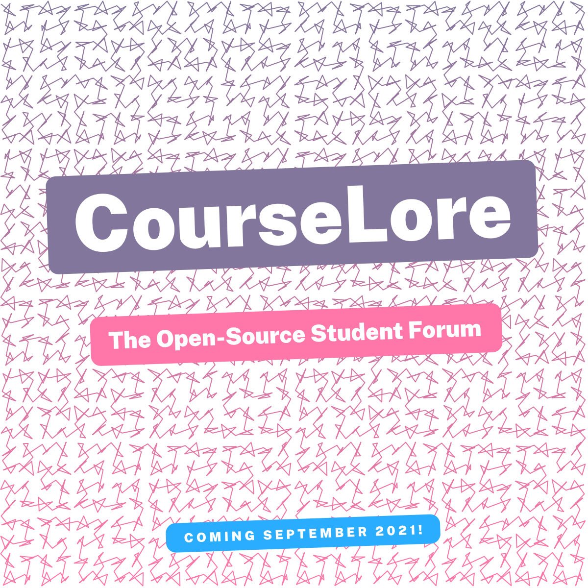

<p align="center">
<a href="https://courselore.org"></a>
</p>
<p align="center">
<a href="https://github.com/courselore/courselore"></a>
<a href="https://www.npmjs.com/package/courselore"></a>
<a href="https://github.com/courselore/courselore/actions"></a>
</p>

### Run the CourseLore Demonstration Server on Your Own Computer

You may run the CourseLore demonstration server on your own computer to play around, try out the features, and determine if CourseLore works for you.

(**Note:** We say that it’s a **demonstration** server because you shouldn’t run CourseLore this way for an actual course (your students wouldn’t be able to access it) (see [§ Host Your Own CourseLore Instance](#host-your-own-courselore-instance) when you’re ready to take that next step). We **do not** mean demonstration as in “now go buy CourseLore Premium,” or “here are some in-app purchases.” There **are no** CourseLore Premium or in-app purchases. CourseLore is and will always be free and open-source.)

- **Option 1 (Simplest):** [Download CourseLore](https://github.com/courselore/courselore/releases), run it, and go to `http://localhost:4000`. (To run CourseLore in macOS you’ll need to right-click on the executable, click on Open, and then confirm that you want to open it. CourseLore as downloaded from the the link above is safe, but hasn’t been signed, so macOS makes you confirm that you trust it.)

- **Option 2 (Advanced):** If you have [Node.js](https://nodejs.org) installed, run:

  ```console
  $ npx courselore
  ```

- **Option 3 (More Advanced):** Run:

  ```console
  $ git clone https://github.com/courselore/courselore.git
  $ cd courselore
  $ npm install
  $ npm start
  ```

### Host Your Own CourseLore Instance

Follow the instructions below to install CourseLore on your own servers. This is the most privacy-preserving way of using CourseLore, because your and your students’ data are under your control. It’s a bit of extra work to setup, but CourseLore has been designed from the beginning to be easy to install and maintain, so it’s an excellent first system administration project. And once it’s been setup, you can mostly forget about it.

#### Requisites

- **Domain:** A domain is an address where you’ll find your CourseLore installation, for example, `example.com`.

  You may use a subdomain under your institution’s domain (for example, `courselore.<university>.edu`) or a domain that you buy (for example, `example.com`). For this second option, most domain sellers work (for `courselore.org` we use [Namecheap](https://www.namecheap.com)) (when looking at domain sellers you may also see them being called **registrars**).

  The important thing to keep in mind when you’re getting a domain is that you must be able to configure a few DNS records for it (more on that below). If you’re using a subdomain under your institution’s domain, ask the system administrator if they can configure a few DNS records for you. If you’re buying your own domain, check with the domain seller if they provide some sort of DNS service that you can configure (most of them do).

- **Server:** A server is just a regular computer that’s always on and connected to the internet.

  You may use a server that’s provided by your institution or a server that you rent. For this second option, most providers of servers for rent work (for `courselore.org` we use [DigitalOcean](https://www.digitalocean.com), and another popular option is [linode](https://www.linode.com)) (when looking at servers for rent you may also see them being called **Virtual Private Servers (VPSs)**).

  In theory you could run CourseLore on a computer that you have at home or at your office, as long as it’s always on and connected to the internet. CourseLore doesn’t use a lot of resources so even an old computer or something like a Raspberry Pi would be enough. But in practice that probably won’t work because CourseLore needs to run a web server, send emails, and so forth, and most domestic internet service providers disable that kind of activity to prevent spam and other kinds of abuse.

  The important things to keep in mind when you’re getting a server are that you must be able to:

  1. Run network services, for example, a web server and an email server. In particular, you must be able to bind services to the network ports 80 and 443 for inbound connections, and you must be able to make outbound connections to port 25. You may also check for firewalls sitting in front of the server.
  2. Have access to the file system (read and write files). (Most providers of **Platform-as-a-Service (PaaS)**, for example, [Heroku](https://www.heroku.com), fail this criterion.)

  If you plan on using a server provided by your institution, you may ask your system administrator about these features. Most servers for rent provide these features.

**TODO: Continue instructions on how to install and setup everything.**

### Setup a Development Environment to Contribute to CourseLore

CourseLore has been designed to be a welcoming project for people who are new to contributing to open-source. Here’s what you need to install to get started:

- [Node.js](https://nodejs.org/)
- [Visual Studio Code](https://code.visualstudio.com) and the following Visual Studio Code extensions:
  - [Prettier - Code formatter](https://marketplace.visualstudio.com/items?itemName=esbenp.prettier-vscode)
  - [es6-string-html](https://marketplace.visualstudio.com/items?itemName=Tobermory.es6-string-html)
  - [es6-string-css](https://marketplace.visualstudio.com/items?itemName=bashmish.es6-string-css)
  - [es6-string-markdown](https://marketplace.visualstudio.com/items?itemName=jeoht.es6-string-markdown)
- [Git](https://git-scm.com)

**Clone and setup the project locally:**

```console
$ git clone https://github.com/courselore/courselore.git
$ cd courselore
$ npm install
$ code .
```

**Run the development server:**

```console
$ npm start
```

**Run the tests:**

```console
$ npm test
```

**Release a new version:**

```console
$ npm version <major|minor|patch>
$ git push --tags
```

### Nightly Builds

Besides the [releases](https://github.com/courselore/courselore/releases), you may also download binaries for every commit as [GitHub Action Artifacts](https://github.com/courselore/courselore/actions) (you must be logged into GitHub). These so-called nightly builds are useful to test the bleeding edge before a release, but aren’t recommended for regular users.

### Roadmap

<details>

### Features

#### Courses

- Basic CRUD:
  - Rename course, and that sort of thing
- Enrollment (user ↔ course) roles
  - Instructor
  - Assistant
  - Student
- States
  - Draft
  - Enrollment
  - Running
  - Archived
- Create roles and manage permissions
- Tag-based actions
- Allow course assistants to create courses?
- Different ways to enroll in the course
  - Invitation only
  - By URL
  - What roles can sign up for themselves
  - Course manager (instructors?) should confirm sign up
- Manage people in the course
  - Change their roles
  - Remove them from the course
- Allow people to disenroll from a course (but we get to keep their contributions as “ghost”)
- Allow people who aren’t even users to sign up & enroll in a single operation
  - Do it with a simple `redirect` option in the sign up process

#### Forum

- Only one kind of post in threads
- Configurable anonymity
  - Only instructors may identify the person
  - Instructors and assistants may identify the person (default)
  - No-one may identify the person
- Don’t implement that idea of collaboratively coming up with an answer (like Piazza) (no-one in the courses I was involved with used that; people just write follow-up answers)
- Notifications
  - How
    - Email
    - In-app
  - What
    - Subscribe to threads
    - Subscribe to whole courses
    - Staff may send messages that are notified to everyone
- Tags
- Reactions & Badges
  - Only allow positive reactions? (Like Facebook) (Probably yes)
  - Allow both positive and negative reactions? (like GitHub / Reddit)
  - Created by/Endorsed by instructor
- States
  - Open
  - Closed
- Visibility
  - To students
  - To staff only (and students that may have posted on it)

#### API

- To integrate with other platforms, like, LMS
- To ask a question from within the text editor, for example

#### Email

- Requirements
  - IPv6.
  - DNS:
    - MX DNS record
      - Check with <https://toolbox.googleapps.com/apps/checkmx/>
    - PTR DNS record
      - IPv4 & IPv6
      - Check with <https://intodns.com/>
    - SPF
      - <https://support.google.com/a/answer/33786#zippy=>
    - DMARC
      - <https://support.google.com/a/topic/2759254>
  - DKIM
    - <https://support.google.com/a/answer/174124?visit_id=637457136864921918-3619574292&ref_topic=2752442&rd=1#zippy=>
    - Key of 1024 bits or longer (recommended is 2048 bits)
  - TLS
  - MTA-STS??
  - ARC??
    - http://arc-spec.org
  - Blacklists
    - Check with
      - https://support.google.com/mail/answer/9981691?visit_id=637457136864921918-3619574292&rd=1
      - https://transparencyreport.google.com/safe-browsing/search
  - Unsubscribe
    - “Use one-click unsubscribe”:
      - <https://support.google.com/mail/answer/81126?hl=en>
        - <https://tools.ietf.org/html/rfc2369>
        - <https://tools.ietf.org/html/rfc8058>
    - Generic troubleshooter
      - <https://support.google.com/mail/troubleshooter/2696779>
  - VERP
    - <https://meta.discourse.org/t/handling-bouncing-e-mails/45343>
- Why not third-party
  - Share data with third party!
  - Cost
  - More stuff to configure
- Third-parties
  - SendGrid
  - SES
  - https://blog.mailtrap.io/free-smtp-servers/
- Libraries
  - https://www.npmjs.com/package/sendmail
  - Nodemailer direct transport (https://github.com/nodemailer/nodemailer/issues/1227)
  - https://www.npmjs.com/package/sendmail
  - https://nodemailer.com/extras/smtp-connection/
  - https://github.com/andris9/mailauth
  - https://www.npmjs.com/package/usemail
  - Haraka
  - https://github.com/substack/node-smtp-protocol
  - https://github.com/zone-eu/zone-mta
- Boxed solutions
  - https://mailinabox.email
  - https://www.iredmail.org
  - https://modoboa.org/en/
  - https://github.com/sovereign/sovereign
  - https://mailu.io/1.7/
  - https://mailcow.email
    - https://www.servermania.com/kb/articles/setup-your-own-email-server/
- Howtos
  - <https://medium.com/@stoyanov.veseline/self-hosting-a-mail-server-in-2019-6d29542dadd4>
  - https://sealedabstract.com/code/nsa-proof-your-e-mail-in-2-hours/
  - https://blog.mailtrap.io/setup-smtp-server/
  - https://arstechnica.com/information-technology/2014/02/how-to-run-your-own-e-mail-server-with-your-own-domain-part-1/
- Testing
  - https://mailtrap.io/
  - https://mailslurper.com

#### Authentication

- Passwordless authentication (Magic links)
  - https://github.com/nickbalestra/zero
  - https://github.com/mxstbr/passport-magic-login
  - https://github.com/vinialbano/passport-magic-link
  - http://www.passportjs.org/packages/passport-passwordless/
  - https://github.com/florianheinemann/passwordless
  - https://hacks.mozilla.org/2014/10/passwordless-authentication-secure-simple-and-fast-to-deploy/
  - https://reallifeprogramming.com/how-to-implement-magic-link-authentication-using-jwt-in-node-8193196bcd78?gi=10747bc1322e
  - Don’t say whether the user is on the database: https://www.linkedin.com/pulse/dont-do-you-implement-magic-links-authentication-adrian-oprea
  - https://blog.jacksonbates.com/passwordless
  - https://www.freecodecamp.org/news/360-million-reasons-to-destroy-all-passwords-9a100b2b5001/
  - https://www.npmjs.com/package/passport-jwt#extracting-the-jwt-from-the-request
  - https://www.youtube.com/watch?v=KiYfWaGRHTc
  - https://softwareontheroad.com/nodejs-jwt-authentication-oauth/
  - https://medium.com/@aleksandrasays/sending-magic-links-with-nodejs-765a8686996
  - https://hackernoon.com/expressjs-integration-guide-for-passwordless-authentication-with-didapp-y55p3yss
  - https://github.com/alsmola/nopassword
  - https://www.wired.com/2016/06/hey-stop-using-texts-two-factor-authentication/
  - https://medium.com/@ninjudd/lets-boycott-passwords-680d97eddb01
  - https://medium.com/@ninjudd/passwords-are-obsolete-9ed56d483eb
  - https://notes.xoxco.com/post/27999787765/is-it-time-for-password-less-login
  - https://notes.xoxco.com/post/28288684632/more-on-password-less-login
  - Let’s not use JWT, because you have to check if a token has already been used anyway; at that point, just give a plain token that you stored in the database.
    - https://www.youtube.com/watch?v=dgg1dvs0Bn4
- Deep links & redirects.
- Prevent people from trying to brute-force login. Put a limit on the amount of magic links you may generate in a period.
- SSO with Hopkins ID
  - SAML

#### User Profile

- Usual CRUD on user profile (name, and so forth).
- Gravatar.
- Multiple emails? Probably not, just the one institutional email (which is the account identifier). If people are affiliated with many institutions it’s likely they’ll be using different CourseLore instances anyway…
- Allow people to remove their accounts.

#### API

- People may want to integrate CourseLore with their existing LMS & other systems.

#### Text Processor

- Add CSS for all the HTML that may be produced (see `hast-util-sanitize/lib/github.json`).
- Emoji with the `:smile:` form.
- Proxy insecure content.
  - https://github.com/atmos/camo
- Reference: <https://github.com/gjtorikian/html-pipeline>

#### Landing Page

- Try to make animation consume less resources. (Currently it’s making the “this tab is consuming too much energy” warning pop up in Safari.)
  - Maybe it has to do with computing the sine of large numbers? Clamp the values between 0–2π to see if that helps…

#### Textarea Niceties

- Store what the user wrote per thread/chat, even if they move to other threads/chats.
  - Garlic.js does that, but it seems a bit old and requires jQuery. Use localStorage instead.
- Some helpers to input Markdown & LaTeX (similar to what GitHub has).
- Upload files (like images), and have them embedded (similar to what GitHub has).
  - Packages to handle multipart form data: busboy, multer, formidable, multiparty, connect-multiparty, and pez.

#### Error Pages

- 400s.
- 500s.
- Form validation errors.

#### Search

- In contents of a course (for example, search for `NullPointerException` to find that thread that helped you out).
  - Search within the scope of a course.
  - Search in all courses you’re taking (for example, search for `deadline extension`).
  - Reference: GitHub let’s you search in different scopes like that.
- Courses in the system (for joining a course).

#### Translate to Other Languages

### Non-Functional Features

- Easy to self-host
- Works on mobile (no apps) & desktop
- Modern & uncluttered interface
- Fast

### Improvements

#### Tests

- Approaches:
  - (What we’re doing now) https://github.com/sindresorhus/got + https://github.com/jsdom/jsdom : Simplest and the best for now since we’re doing server-side rendering.
  - https://github.com/puppeteer/puppeteer / https://github.com/smooth-code/jest-puppeteer : It’s a bit more magic, since it actually runs a browser.
  - https://www.cypress.io : Full-blown magic…

#### Page Transitions & Client-Side JavaScript

- https://hotwire.dev
  - https://www.npmjs.com/package/express-hotwire
  - https://github.com/turbolinks/turbolinks
- https://docs.stimulusreflex.com
- https://barba.js.org
- https://swup.js.org/getting-started
- https://unpoly.com
- https://youtube.github.io/spfjs/

#### Code Base

- Consider using **session per request** middleware for database transactions.
  - Considerations:
    - We shouldn’t keep the transaction open across ticks of the event loop, which entails that all request handlers would have to be synchronous.
    - Moreover, as far as I can tell the only way to run a middle **after** the router is to listen to the `res.once("finish", () => {...})` event. But I think that this goes across ticks of the event loop.
    - Maybe I can just call `next()` and then look at the `res.statusCode`?
    - I think that transactions are only relevant if you’re running in cluster mode, because otherwise Node.js is single-threaded and queries are serialized, anyway.
  - References:
    - https://goenning.net/2017/06/20/session-per-request-pattern-go/
    - https://stackoverflow.com/questions/24258782/node-express-4-middleware-after-routes
    - https://www.lunchbadger.com/blog/tracking-the-performance-of-express-js-routes-and-middleware/
    - https://stackoverflow.com/questions/27484361/is-it-possible-to-use-some-sort-of-middleware-after-sending-the-response-with
    - https://stackoverflow.com/questions/44647617/middleware-after-all-route-in-nodejs
    - https://github.com/jshttp/on-finished
    - https://github.com/pillarjs/router/issues/18
- Produce native ESM:
  - It’s too fresh, assess again start 2021-08.
  - Blocked by experimental support in ts-node-dev (https://github.com/TypeStrong/ts-node/issues/1007) & Jest (https://jestjs.io/docs/en/ecmascript-modules).
  - ESM unlocks top-level await and eliminates the need for `appGenerator()`.
- Consider using a CSS framework:
  - Bootstrap: The most popular.
  - TailwindCSS: The hot new option.
- <https://github.com/wclr/ts-node-dev/issues/243>: Stop using `--pool` when calling `ts-node-dev`.
- Call Prettier to check contents of `public/` folders.

#### Deployment

- Graceful HTTP shutdown

  ```js
  process.on("SIGTERM", () => {
    debug("SIGTERM signal received: closing HTTP server");
    server.close(() => {
      debug("HTTP server closed");
    });
  });
  ```

  - https://github.com/gajus/http-terminator

- Helmet.
- csurf.
- Compression.

- HTTPS:

  - Consider using <https://www.npmjs.com/package/@small-tech/https>
  - Use Caddy
    - Manage with https://pm2.keymetrics.io/docs/usage/pm2-api/
  - Use another reverse-proxy / load balancing solution: https://balance.inlab.net
  - Use certbot:
    - <https://www.sitepoint.com/how-to-use-ssltls-with-node-js/>
  - Or roll out our own thing:
    - ACME implementations
      - <https://www.npmjs.com/package/acme-v2>
      - <https://www.npmjs.com/package/acme-client>
      - <https://www.npmjs.com/package/acme-middleware>
      - <https://github.com/publishlab/node-acme-client>
      - <https://github.com/compulim/acme-http-01-azure-key-vault-middleware>
      - <https://letsencrypt.org/docs/client-options/>
    - ACME description: <https://tools.ietf.org/html/rfc8555>
    - Implementations of cryptography
      - Node’s crypto
      - <https://github.com/brix/crypto-js>
      - <https://github.com/digitalbazaar/forge>
    - Other considerations:
      - HSTS:
        - <https://developer.mozilla.org/en-US/docs/Web/HTTP/Headers/Strict-Transport-Security>
        - Helmet.
    - HTTP → HTTPS
      - <https://www.npmjs.com/package/express-force-https>
  - Verify: https://www.ssllabs.com

- HTTP/2:

  - <https://github.com/expressjs/express/issues/3388>: Express doesn’t work with Node’s http/2 implementation, because the `req` and `res` aren’t compatible.
  - Using Greenlock: https://git.rootprojects.org/root/greenlock-express.js/src/branch/master/examples/http2/server.js
  - Use the spdy package (seems abandoned, and people said it doesn’t work with recent versions of node: https://github.com/spdy-http2/node-spdy/issues/380)
  - Try express 5.
  - <https://gist.github.com/studentIvan/6c78886c140067936ff379031fd12e14>
  - Frameworks that seem to support it out of the box:
    - koa
    - Hapi
    - tinyhttp

- Auto-updater
- `download.courselore.org` points to installer.

- A version hosted by us for other people to use (not just demo)

  - In addition, or as an alternative, a demo version that self destructs every hour (like Moodle: https://moodle.org/demo)

- Supervisors
  - systemd
  - PM2
  - Nodemon
  - Forever
- Packagers
  - Docker
  - https://github.com/vercel/pkg/pull/837#issuecomment-775362263
  - Electron (for demo only, of course)
- “One-click deployment” for different platforms like DigitalOcean, Linode, and so forth.
  - DigitalOcean
  - Linode
  - Amazon
  - Google Cloud
  - https://sandstorm.io

### Documentation

### Open-Source Contributions

- <https://github.com/DefinitelyTyped/DefinitelyTyped/issues/50794>: Add more specific types to better-sqlite3 with generics.
- <https://github.com/actions/upload-release-asset/issues/56>: Document how to create a release in one GitHub Actions job and upload assets in another.
- Prettier: Bug Report: When formatting Markdown within a JavaScript tagged template literal, Prettier adds space at the end. This breaks the es6-string-markdown Visual Studio Code extension.
  - Get rid of the `// prettier-ignore`.
- <https://github.com/syntax-tree/hast-util-sanitize/pull/21>: Add types to the JSON in hast-util-sanitize.
- <https://npm.im/hast-util-to-text>: Write types.
  - <https://github.com/leafac/rehype-shiki/blob/ca1725c13aa720bf552ded5e71be65c129d15967/src/index.ts#L3-L4>
- Questions about Greenlock
  - <https://git.rootprojects.org/root/greenlock.js/issues/41>: Does it use https://greenlock.domains or does it go straight to LetsEncrypt?
  - <https://git.rootprojects.org/root/greenlock-express.js/issues/50>: Can we get TypeScript types?

### Marketing

- Newsletter
- Create CourseLore Gravatar
  - Use in npm
- Create accounts on:
  - Patreon
  - PayPal
  - Facebook
  - Instagram
  - Reddit

### References

- GitHub
- Slack
- <https://campuswire.com>
- <https://piazza.com/>
- <https://discourse.org>
- <https://us.edstem.org>
- <https://aula.education>
- <https://yellowdig.com>
- <https://moodle.org>
- Canvas
- <https://www.reddit.com>
- Basecamp
- <https://www.codegrade.com/>
  - <https://app.codegra.de/login>
  - <https://github.com/CodeGra-de>
  - <https://github.com/CodeGrade/bottlenose>
- <https://glacial-plateau-47269.herokuapp.com/>
  - <https://glacial-plateau-47269.herokuapp.com/jhu/login>
- <https://www.acadly.com/>
- References in self-hosting
  - https://www.reddit.com/r/selfhosted/
  - Discourse
  - Mattermost
  - Moodle
  - GitLab
  - WordPress
  - https://github.com/RocketChat/Rocket.Chat
  - https://gitea.io/
  - https://gogs.io/
- <https://github.com/npm/roadmap/projects/1>: A meta-reference on how to present the roadmap moving forward.

</details>

### Meetings

<details>
<summary>2021-02-20</summary>

- Demonstration:
  - Clearer communication in sign-up/sign-in.
  - Create course.
  - Join course.
  - Create thread.
- Automated tests.
  - **Got + JSDOM** / Puppeteer / Cypress / Selenium.
- The packaging is working on Windows.
- How to invite people to the course?
  - With link.
  - With a list of emails.
- How should threads look like? One page for the list of threads and one page per thread (à la GitHub Issues), or one page with both the list of threads and one thread (à la Mail.app (and Piazza, for that matter…))?

</details>

<details>
<summary>2021-02-13</summary>

- Finish the account creation workflow and wired it to the authentication workflow demonstrated last week.
- Tried to use [ECMAScript modules](https://nodejs.org/api/esm.html) (because of top-level async/await). Still too fresh. While Node’s support for them isn’t experimental anymore, some of the underlying infrastructure still is, so other tools in the ecosystem (for example, Jest & ts-node-dev) don’t support them very well (require flags and whatnot).
- Had issues with some native modules (for example, sharp) not working with @leafac/pkg. Ended up creating <https://npm.im/caxa>.
- Had issues with types for <https://www.npmjs.com/package/express-async-handler>. Ended up creating <https://npm.im/@leafac/express-async-handler>.
- Created a proper **demonstration** mode for CourseLore.

</details>

<details>
<summary>2021-02-06</summary>

- Wrote documentation at https://github.com/courselore/courselore and these documents you’re looking at.

- Last week Dr. Scott asked what are the operating system dependencies to run the `courselore` executable (which is generated with @leafac/pkg). To answer this, I tested putting the binary in a Docker container created from [scratch](https://hub.docker.com/_/scratch); that didn’t work. Then I tried [alpine](https://hub.docker.com/_/alpine); that didn’t work either! Then I tried [ubuntu](https://hub.docker.com/_/ubuntu/); that worked (naturally, since we’re running Ubuntu in production & on GitHub Actions). So, as it turns out, not only does the `courselore` executable need some support from the operating system, but it seems like lightweight things like musl libc may not be enough. I’ll take that…

- Did the signup / login flow with magic links: https://courselore.org/login

  - Login workflow
  - Sessions
  - Database

- Changes to the website:

  - Wider.
  - Mention API.
  - Convert to Markdown and use the text processing pipeline we developed for forum posts.

- Open-source contributions:

  - <https://www.npmjs.com/package/@leafac/sqlite>
  - <https://www.npmjs.com/package/@leafac/sqlite-migration>
  - <https://github.com/leafac/pkg/commit/ccc29eadc33f7a92179a68614e9d7ab1b5017e6c>

</details>

<details>
<summary>2020-01-30</summary>

#### Progress Report

- The text processor for posts is done. It supports Markdown, LaTeX, and syntax highlighting. Also, it’s secure against Cross-Side Scripting (XSS) attacks. [Here’s some input that exercises all these features](https://github.com/courselore/courselore/raw/e01f05f87039326fba47abab24c78a754a4ff7a8/misc/text-processor-example.md).

- Setup the infrastructure for GitHub Actions:

  - Run the test suite on Linux, macOS, and Windows.
  - Create binaries for all these operating systems.
  - Distribute the binaries as [releases](https://github.com/courselore/courselore/releases/) and as [nightly builds](https://github.com/courselore/courselore/actions/runs/537293785) (GitHub Actions Artifacts)

- Released the following packages:

  - <https://npm.im/courselore>: If people already have Node.js installed, they may try CourseLore with `npx courselore`. Also, they may `npm install courselore` to mount CourseLore as part of a bigger Node.js application. That isn’t the preferred deployment strategy (using the binaries is), but it’s a possibility for advanced users.

  - <https://npm.im/@leafac/rehype-shiki>: Rehype is part of the text processor, and Shiki is a syntax highlighter based on Visual Studio Code’s syntax highlighter. <https://npm.im/@leafac/rehype-shiki> is a package that connects the two and improves on the existing <https://npm.im/rehype-shiki> with support for the latest Shiki version, some architectural differences that decouples the dependencies a little better, and brings TypeScript support.

  - <https://npm.im/@leafac/html>: A safe and convenient way to use JavaScript’s tagged template literals as an HTML template engine.

  - <https://npm.im/@leafac/pkg>: Fixes some problems with <https://npm.im/pkg>, particularly in how it manages native modules.

#### Design Decisions

- The course URLs may be:

  - **In a flat namespace or in a hierarchical namespace.** A flat namespace is like Reddit’s `/r/<name>`, and a hierarchical namespace is like GitHub’s `/<user-or-organization>/<repository>`.

    - A flat namespace is good because it’s simpler, particularly in self-hosted installations for a single user (think of how silly `courselore.leafac.com/leafac/<course>` looks).

    - A flat namespace is bad because it clashes easily (think of multiple teaching a course identified as `cs-101`).

    - A hierarchical namespace makes sense when there’s the notion of **organizations**, which could be a group of people who have several courses together. That case probably is rare.

  - **Given by the user, or generated by the system.** An URL given by the user is like Reddit’s and GitHub’s URLs (for example `github.com/leafac/<repository>`). An URL generated by the system is like YouTube (for example, `youtu.be/<random-string-that-is-the-video-identifier>)`.

    - An URL given by the user is simpler to share (think of an URL projected on the board in a classroom).

    - URLs given by the user are more complex for the system, because we have to handle renames, redirects, and so forth.

  - **We decided to go with a flat namespace and system-generated URLs.** For example, `courselore.org/fjdkwoer83`. Because URLs are generated by the system, we don’t see a need for a subpath like `/r/<something>`. We know not to generate identifiers that would clash with routes we’d want to use, for example `/settings`. We may want to have some sort of aliasing in the future so users can create their own readable URLs if they want.

  - **References:**

    - Piazza has alises like `piazza.com/jhu/fall2020/en601329/home`.
    - Campuswire uses the Reddit approach with URLs like `campuswire.com/c/G9E051068/feed`.
    - They have different URLs for joining a course and then later for visiting it. We don’t want that.
    - <https://www.acadly.com/> only has the **magic link** approach.
    - <https://superauth.com>: A technology to handle authentication.

- Authentication methods:

  - The options are:

    1. A plain username/password authentication strategy.
    2. A **magic link** approach like Slack.
    3. Single sign-on integrated with universities’ systems.

  - We’re going with Option 2 for now, as it seems like a good sweet-spot in terms of security, simplicity to implement, and generality. It works for every university without extra effort on our part. That said, we may still give Option 1 as an alternative (as Slack does). Also, people may customize CourseLore with their own routes to implement Option 3.

  - **Note:** We’re following Slack in the approach to authentication (the so-called **magic link**), but we’re **not** going to have the weird separation of accounts per team that Slack has. There will only be one CourseLore account per email and the user may join multiple courses.

</details>

<details>
<summary>2021-01-06</summary>

- The project has officially started! 🙌
- How we’re different from existing platforms
  - Open-source
  - Self-hosting option
  - Privacy & more care with students data
  - Slicker interface than Piazza
  - Lightweight when compared to full LMS like Moodle
  - Articles showing that people care about these issues:
    - https://thetech.com/2020/03/05/piazza-security
    - https://www.stanforddaily.com/2020/10/04/concerned-with-piazzas-data-privacy-management-some-professors-look-to-alternative-discussion-forums/
    - https://matheducators.stackexchange.com/questions/7406/more-user-friendly-alternatives-to-piazza-service
    - https://redecentralize.org
- We’re meeting on Saturdays, at 10:00 EST
- Our next steps are to come up with a name and investigate the competition to come up with a list of initial features

</details>

<details>
<summary>2021-01-05</summary>

- Vision
  - An open-source platform for course interactions
- Key features
  - Piazza
    - Q&A
    - Announcements
    - Anonymity
    - Chat
  - More interactive/modern interface
  - FERPA compliance and stuff
- Competition
  - https://piazza.com/
  - https://campuswire.com
  - https://discourse.org
    - Hartz at MIT doing it - see https://thetech.com/2020/03/05/piazza-security
    - https://www.stanforddaily.com/2020/10/04/concerned-with-piazzas-data-privacy-management-some-professors-look-to-alternative-discussion-forums/
    - https://matheducators.stackexchange.com/questions/7406/more-user-friendly-alternatives-to-piazza-service
    - Could we do a Discourse plugin?
  - https://us.edstem.org
  - https://aula.education
  - https://yellowdig.com
  - Moodle
    - It’s a whole LMS, not a Q&A

</details>
