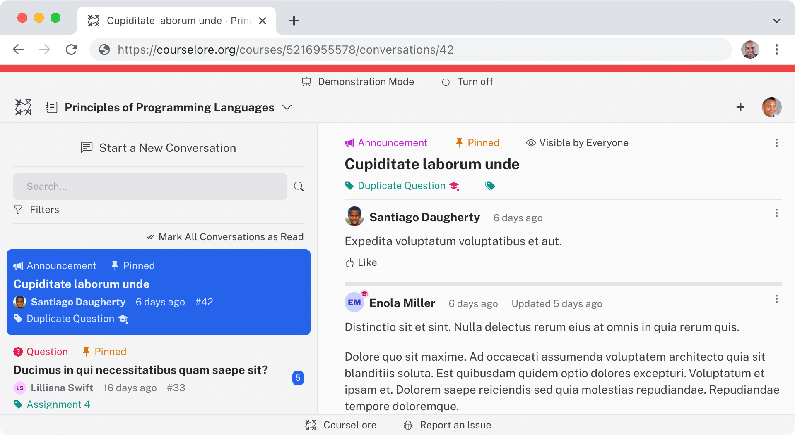

<h1 align="center"><a href="https://courselore.org">Courselore</a></h1>
<h3 align="center">Communication Platform for Education</h3>

<h3 align="center">
<a href="https://courselore.org">Hosted Installation</a> ·
<a href="https://try.courselore.org">Development Installation</a> ·
<a href="https://courselore.org/courses/8537410611/invitations/3667859788">Meta Courselore</a>
</h3>

## Features

- **Forum & Chat.** Question & answer. Announcements. Comprehensive search. Notifications.
- **For Education.** Anonymity. Private questions. Straightforward invitation system.
- **Open Source.** Easy to self-host for maximum privacy & control. Welcoming to first-time contributors.
- **Carefully Designed.** Dark Mode. First-class mobile support.
- **Rich-Text Messages.** [Markdown](https://guides.github.com/features/mastering-markdown/). [LaTeX](https://katex.org/docs/supported.html). [Syntax highlighting](https://shiki.matsu.io/).

## Documentation

- [**Self-Hosting**](/documentation/self-hosting.md)
- [**Setting Up for Development**](/documentation/setting-up-for-development.md)
- [**Changelog**](/documentation/changelog.md)
