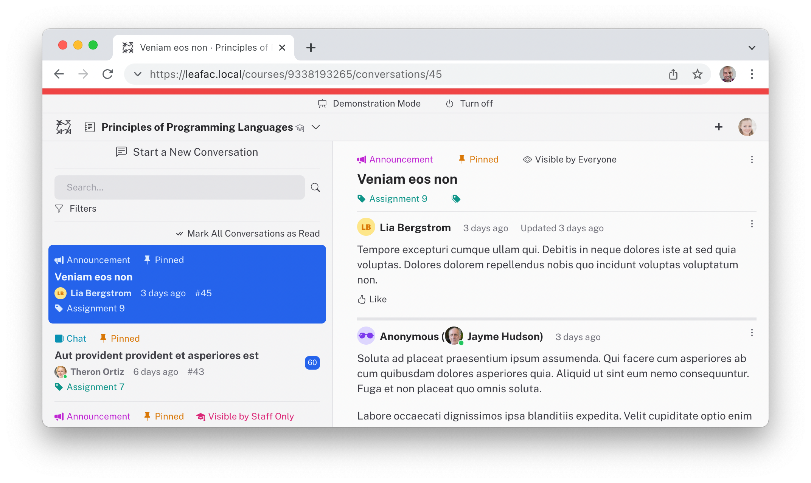

<h1 align="center"><a href="https://courselore.org">CourseLore</a></h1>
<h3 align="center">Communication Platform for Education</h3>
<h3 align="center"><a href="https://courselore.org">https://courselore.org</a></h3>

### Features

- Forum & chat.
- Best-in-class rich-text messages with Markdown & LaTeX.
- Anonymity & private questions.
- Comprehensive search & filters.
- Straightforward invitation & onboarding system.
- Modern, clean interface.
- Works great on phones & on Dark Mode.
- Open-source & easy to self-host.
